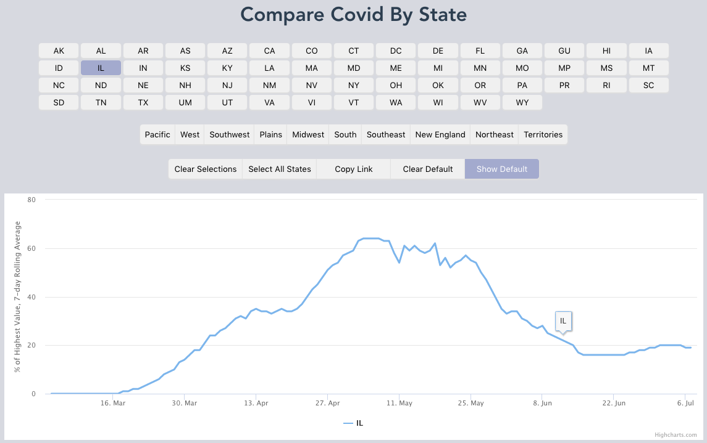

# covidbystate

Compare Covid daily graphs state by state

[](https://app.netlify.com/sites/covidbystate/deploys)

Features:

 - Custom normalization of data according to highest daily case count per state
 - Link to various state configurations
 - Preset regions and state groupings
 - Copy link to current state configuration
 - Save default state or group of states

[](https://covidbystate.org)

## Project setup
```
npm install
```

### Compiles and hot-reloads for development
```
npm run serve
```

## Third party dependencies

[ The Covid Tracking Project](https://covidtracking.com/api)

[ Highcharts](https://www.highcharts.com/)

